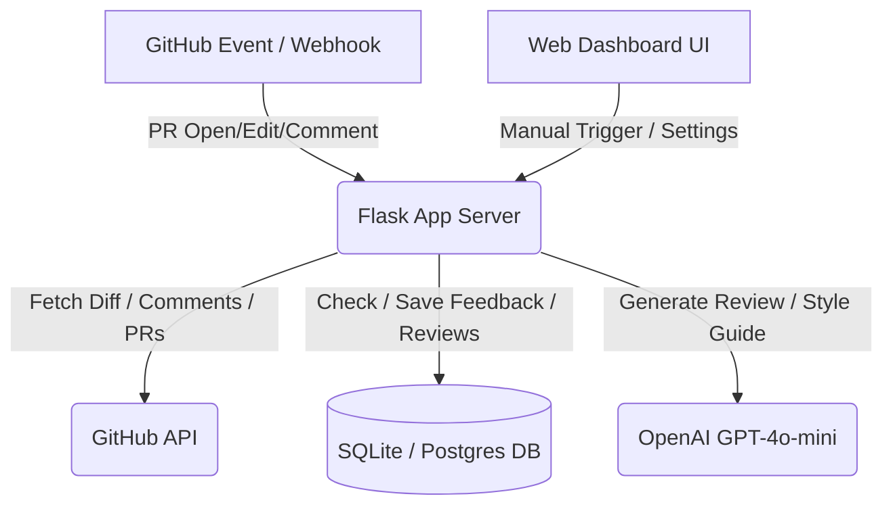

# ReviewMind — Final Project Documentation

ReviewMind is a secure, production-ready, AI-powered PR review assistant that reads code diffs, generates smart suggestions based on team coding preferences, opens automated fix branches/PRs, and commits updated style guidelines (`TEAM_STYLE.md`) back to the repository as the team's preferences evolve.

This document serves as the final, comprehensive summary of the architecture, file layout, endpoints, database schema, and verification of the ReviewMind project.

---

## 🏛️ System Architecture

ReviewMind sits between developer workspaces, a persistent storage layer, and GitHub via Webhook callbacks and REST API calls:



1. **Webhook Processing**: Listens for PR and comment events, reviews incoming diffs, and writes comments back to GitHub.
2. **Interactive Dashboard**: Provides a dark-themed control center to monitor acceptance rates, review count stats, and seed simulated feedback.
3. **AI Reasoning Loop**: Learns from developer feedback (accepts or rejects of suggestions) and customizes subsequent reviews using the learned rules.
4. **Style Guide Generation**: Commits updated standard files (`TEAM_STYLE.md`) directly to the repository when enough feedback is logged.

---

## 📂 Complete File Structure

The project codebase is structured as follows:

```text
reviewmind/
│   __init__.py
│   app.py            # Main entry point, webhook dispatcher, and API routes
│   config.py         # App configurations and startup validation logic
│   dashboard.py      # Flask Blueprint for UI routing and demo requests
│   db.py             # SQLite / PostgreSQL ThreadedConnectionPool layer
│   demo_data.py      # Demo seeder for sandbox/hackathon presentations
│   feedback.py       # GitHub webhook handlers for comments and PR merges
│   fixer.py          # Auto-PR branch creation and code replacement routines
│   reviewer.py       # AI prompt structuring, response validation, risk classification
│   style_writer.py   # Style snapshot generators and TEAM_STYLE.md commits
│
├───templates/        # UI Jinja2 templates (separated from code logic)
│       404.html
│       500.html
│       dashboard.html
│       landing.html
│       setup.html
│
tests/
│   __init__.py
│   test_core.py      # Suite of 32 unit tests verifying the entire system
│
│   .env              # Environment configurations (local-only, not committed)
│   .env.example      # Sample configurations template
│   .gitignore
│   Dockerfile        # Production multi-stage Docker build
│   final.md          # Complete project summary (this file)
│   PROJECT_PROGRESS.md
│   README.md         # Public project readme
│   requirements.txt  # Dependencies list (gunicorn, flask, openai, PyGithub, etc.)
│   render.yaml       # Render.com IaC deployment configuration
```

---

## ⚙️ Module Descriptions

### 1. Web Core & Webhooks ([app.py](file:///c:/Users/NagaSaiRahulVudumula/Documents/reviewmind/reviewmind/app.py))
- Orchestrates Flask routing, Blueprints, custom error handlers (404/500), and webhook validation.
- Verifies GitHub payload signatures (`X-Hub-Signature-256`) using HMAC-SHA256 to ensure authenticity.
- Handles `/health` checks by validating the database connection.
- Uses a thread-safe in-memory rate-limiter (`@rate_limit`) to shield high-load routes.

### 2. Dashboard UI Blueprint ([dashboard.py](file:///c:/Users/NagaSaiRahulVudumula/Documents/reviewmind/reviewmind/dashboard.py))
- Renders the interactive dashboard using Jinja2 templates with GitHub-dark aesthetics.
- Dynamically fetches database metrics, weekly stats, and recent suggestions.
- Hosts sandbox testing (`/demo-review`) to scan diffs interactively from the web UI.

### 3. Database Layer ([db.py](file:///c:/Users/NagaSaiRahulVudumula/Documents/reviewmind/reviewmind/db.py))
- Provides database connection pooling via `ThreadedConnectionPool` for PostgreSQL and SQLite contexts.
- Dynamically rewrites dialect queries (changing placeholders from `?` to `%s`, serial keys, dates) so the app functions identically on SQLite and PostgreSQL.

### 4. Configuration Guard ([config.py](file:///c:/Users/NagaSaiRahulVudumula/Documents/reviewmind/reviewmind/config.py))
- Reads configuration variables from environment variables and `.env`.
- Includes startup validation to immediately warn operators if API tokens are missing or configured in `mock` mode.

### 5. AI Reviewer Engine ([reviewer.py](file:///c:/Users/NagaSaiRahulVudumula/Documents/reviewmind/reviewmind/reviewer.py))
- Compiles the system review prompt utilizing historical accepted and rejected style guidelines.
- Structures outputs using OpenAI schema parsing to retrieve specific structured JSON outputs.
- Adds risk keyword classification (`High`, `Medium`, `Low`) to review suggestions.
- Utilizes the `@retry_openai` decorator with exponential backoff to handle transient API failures.

### 6. Code Fix PRs ([fixer.py](file:///c:/Users/NagaSaiRahulVudumula/Documents/reviewmind/reviewmind/fixer.py))
- Leverages PyGithub to automatically spin up git branches, apply recommended code changes, commit them, and issue automated fix pull requests linked back to the target PR.

### 7. Style Generator ([style_writer.py](file:///c:/Users/NagaSaiRahulVudumula/Documents/reviewmind/reviewmind/style_writer.py))
- Summarizes patterns accepted or rejected by the team.
- Formulates and pushes clean `TEAM_STYLE.md` files to the code repository when a threshold of 20 feedbacks is met.

### 8. Feedback Loop ([feedback.py](file:///c:/Users/NagaSaiRahulVudumula/Documents/reviewmind/reviewmind/feedback.py))
- Decodes comment messages like `reviewmind accept` or `reviewmind reject` to update database parameters, creating a closed-loop training dataset.

---

## 🔒 Security Hardening Controls
- **Inputs**: Sanitized repository parameters using strict regex rules (`owner/repo`), bound diff lengths to 1MB, and validated PR identifiers.
- **Webhooks**: Required signature validation with `X-Hub-Signature-256`.
- **API Shielding**: Thread-safe client IP rate limiting on core POST requests.

---

## 📊 Complete Database Schema

ReviewMind uses three primary relational tables:

### `feedback`
Persists the individual developer actions (accepts/rejects) on reviews.
- `id`: INTEGER PRIMARY KEY AUTOINCREMENT / SERIAL
- `repo`: TEXT (e.g., `'owner/repo'`)
- `pr_number`: INTEGER
- `suggestion_text`: TEXT
- `code_context`: TEXT
- `accepted`: INTEGER (0 for rejected, 1 for accepted)
- `fix_pr_merged`: INTEGER (0 or 1)
- `timestamp`: DATETIME DEFAULT CURRENT_TIMESTAMP

### `reviews`
Logs historical diffs run by ReviewMind.
- `id`: INTEGER PRIMARY KEY AUTOINCREMENT / SERIAL
- `repo`: TEXT
- `pr_number`: INTEGER
- `diff`: TEXT
- `suggestions`: TEXT (JSON serialized recommendations)
- `fix_branch`: TEXT
- `timestamp`: DATETIME DEFAULT CURRENT_TIMESTAMP

### `style_snapshots`
Records generated markdown drafts of the style guides.
- `id`: INTEGER PRIMARY KEY AUTOINCREMENT / SERIAL
- `repo`: TEXT
- `style_md`: TEXT
- `acceptance_rate`: REAL
- `timestamp`: DATETIME DEFAULT CURRENT_TIMESTAMP

---

## 🛣️ API Endpoints

| Route | Method | Access | Rate Limit | Description |
|---|---|---|---|---|
| `/` | `GET` | Public | None | Product landing page. |
| `/setup` | `GET` | Public | None | Status dashboard showing key checks for API & DB. |
| `/dashboard` | `GET` | Public | None | Dashboard showing repository learning states. |
| `/health` | `GET` | System | None | Liveness check (checks DB connection). |
| `/webhook` | `POST` | GitHub | None | Receives event payloads from GitHub. |
| `/review-pr` | `POST` | UI | 5 req / 60s | Triggers live review on target GitHub PR. |
| `/feedback` | `POST` | UI | None | Logs an accept or reject action from dashboard. |
| `/simulate-learning` | `POST` | UI | None | Seeds 20 mock records for sandbox testing. |
| `/style-preview` | `POST` | UI | None | Generates a style guide preview draft. |
| `/style-commit` | `POST` | UI | 5 req / 60s | Commits `TEAM_STYLE.md` to GitHub. |
| `/demo-review` | `POST` | UI | 10 req / 60s | Reviews pasted diff snippets interactively. |

---

## 🧪 Verification and Test Suite

ReviewMind is covered by 32 tests in [tests/test_core.py](file:///c:/Users/NagaSaiRahulVudumula/Documents/reviewmind/tests/test_core.py) that mock database and OpenAI connection details to run safely and quickly:

1. **Database Methods**: Verifies feedback creation, reading accepted/rejected patterns, calculating rates, tracking counts, and saving reviews.
2. **Review Formatting & Badges**: Asserts that issues are categorized correctly (`High`, `Medium`, `Low`) based on keywords and output strings.
3. **Application Routing**: Confirms 200 codes on `/`, `/setup`, and custom 404 responses.
4. **Input Constraints**: Asserts validation blocks for incorrect repo configurations, negative PR numbers, and giant diff inputs.
5. **Rate Limiting**: Verifies that requests exceeding limits return `429 Too Many Requests`.
6. **Liveness Check**: Verifies `/health` fails with `503` when database queries throw exceptions.
7. **Decorator Retry**: Asserts exponential retries for transient HTTP errors and error propagation for hard failures.
8. **PostgreSQL Contexts**: Validates database queries, syntax mapping (to PostgreSQL), and threaded connection checkout/release cycles.

Run the test suite locally with:
```powershell
.venv\Scripts\python.exe -m unittest tests.test_core
```

Output:
```text
Ran 32 tests in 3.192s

OK
```

---

## 🚀 Deployment Instructions

### 1. Build and Run via Docker
```powershell
# Build image
docker build -t reviewmind:latest .

# Run container
docker run -p 5000:5000 --env-file .env reviewmind:latest
```

### 2. Infrastructure Deployment (Render.com)
The codebase includes [render.yaml](file:///c:/Users/NagaSaiRahulVudumula/Documents/reviewmind/render.yaml) for automated infrastructure deployment. To deploy:
1. Connect the GitHub repository to your Render Account.
2. Render will automatically read `render.yaml` to spin up a Web Service using `gunicorn reviewmind.app:app`.
3. Set the required production environment variables:
   - `OPENAI_API_KEY`
   - `GITHUB_TOKEN`
   - `GITHUB_WEBHOOK_SECRET`
   - `DATABASE_URL` (automatic when attaching a Render PostgreSQL Database)
